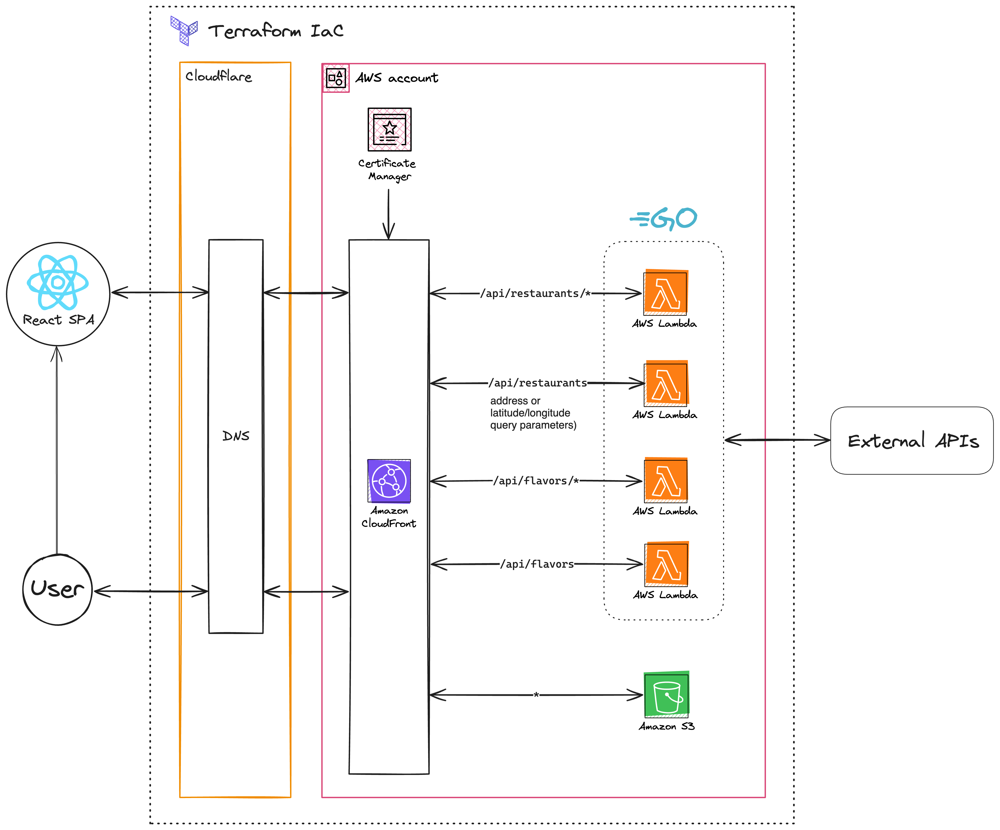

# Fodder

## Motivation

A few years ago, a certain midwestern fast-food restaurant chain discontinued its mobile app. I used their app for one specific reason: to check the **F**lavor **O**f the **D**ay (FOD). While their website still provides this information, I found it to be too slow and clunky for this one purpose. This motivated me to create an app with the goal of providing a simpler and faster user experience.

## Running Locally

### Prerequisites

- Required
  - [Node.js](https://nodejs.org/en)
  - [pnpm](https://pnpm.io)
- Optional
  - [AWS CLI](https://aws.amazon.com/cli/)
  - [Terraform](https://www.terraform.io/)
  - [Docker](https://www.docker.com/)
  - [Act](https://nektosact.com/)

### Setup

Clone the repository and install dependencies:

```bash
git clone git@github.com:declanlscott/fodder.git
cd fodder
pnpm i
```

Create the necessary environment files:

```bash
cp apps/backend/.dev.vars.example apps/backend/.dev.vars
cp apps/frontend/.env.example apps/frontend/.env
```

Build the monorepo packages and start the dev servers:

```bash
pnpm --filter "@repo/*" build
pnpm dev
```

### GitHub Actions

This project uses GitHub Actions for CI/CD. To run the CI/CD pipeline locally, you can use [Act](https://nektosact.com/). Follow the [installation instructions](https://nektosact.com/installation/index.html) for your operating system.

Create an `act.secrets` file in the root of the repository similar to [`act.secrets.example`](https://github.com/declanlscott/fodder/blob/main/act.secrets.example).

On an Apple silicon Mac, I run the following command. If you are running on a different platform, you may not need the `--container-architecture` flag.

```bash
act --container-architecture linux/amd64 --var-file act.variables --secret-file act.secrets
```

## Technologies

- Infrastructure
  - Terraform IaC
  - Cloudflare
    - DNS
    - Workers
  - AWS
    - CloudFront
    - S3
    - IAM
    - ACM
    - DynamoDB (for terraform state)
- Backend
  - Hono (with integration tests)
  - TypeScript
- Frontend
  - Vite
  - React
  - TypeScript
  - Tailwind CSS

## Architecture


