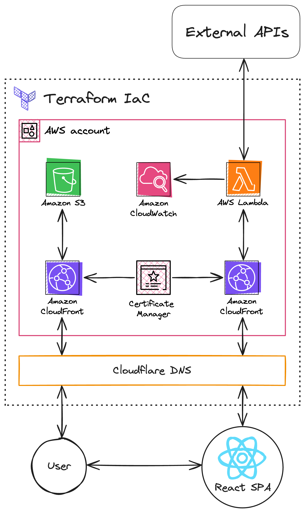

# Fodder

## Motivation

A few years ago, a certain midwestern fast-food restaurant chain discontinued its mobile app. I used their app for one specific reason: to check the **F**lavor **O**f the **D**ay (FOD). While their website still provides this information, I found it to be too slow and clunky for this one purpose. This motivated me to create an app with the goal of providing a simpler user experience.

## Technologies

- Infrastructure
  - Terraform IaC
  - Cloudflare
    - DNS
  - AWS
    - CloudFront
    - Lambda
    - S3
    - ACM
    - IAM
    - DynamoDB
- Backend
  - Golang (unit tested)
- Frontend
  - TypeScript
  - React
  - Tailwind CSS
  - Vite
  - [And more...](frontend/package.json)

## Architecture

